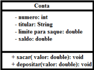

# Atividade de POO 3
Faça um programa para ler os dados de uma conta bancária e depois realizar um saque nesta conta bancária, mostrando o novo saldo. Um saque não pode ocorrer se não houver saldo na conta, ou se o valor do saque for superior ao limite de saque. Implemente uma conta bancária conforme projeto abaixo usando conceitos de tratamento de exceção:

    

